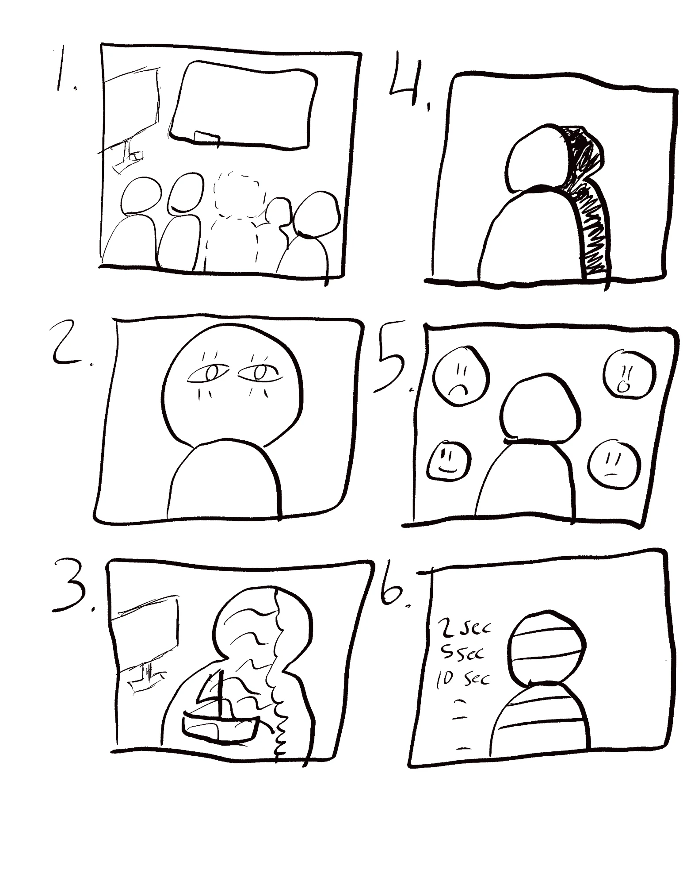
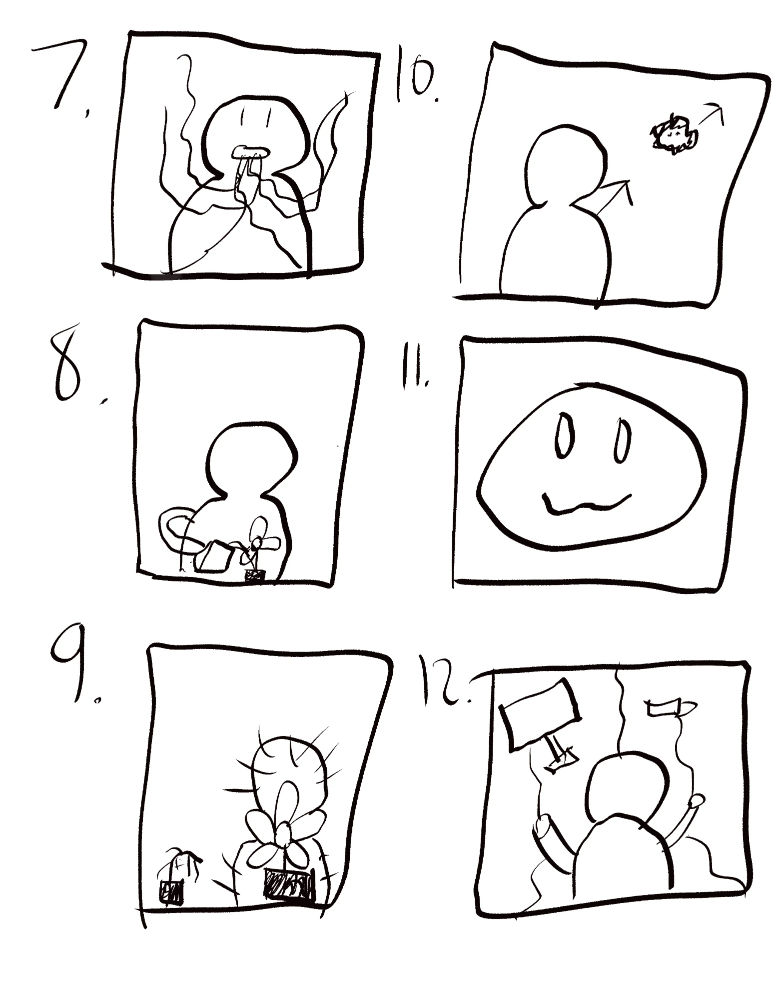

# Ten Concepts

These are ten ideas for the weird mirror project. The rule I kept in mind the
whole time is that someone walks up with no clue what this is, nobody explains
it to her, and there is no sign on the wall. So every one of these has to teach
itself in a couple of seconds.

My sketches are at the bottom.

---

## 1. The Missing Guest

**Input:** Where she is standing, picked up by the camera.

**What changes:** The screen shows the room behind her exactly as it looks in
real life. Everything is there. She is not. She is cut out of her own
reflection.

**How she knows:** Anyone else in the room shows up on screen totally normally.
She is the only thing missing. If a friend walks up next to her, the friend
appears and she still doesn't, which makes it obvious the piece is doing it on
purpose and doing it to her.

---

## 2. Blink

**Input:** Her face in front of the camera.

**What changes:** It is a completely normal mirror with one rule broken. The
reflection blinks on its own, at times when she isn't blinking.

**How she knows:** She already knows what a mirror is, so there is nothing to
learn. The blink is the only thing wrong in the whole image, and she catches it
because she knows she didn't blink. Small idea but it gets under your skin.

---

## 3. Window Body

**Input:** The shape and position of her silhouette.

**What changes:** Inside her outline is somewhere else. In my sketch it is an
ocean with a boat on it. Outside her outline is the plain room. She is a hole
that another place is showing through.

**How she knows:** The shape is obviously hers and it moves when she moves.
Raising an arm makes the window bigger and lets her see more of the other place,
so she figures out pretty fast that she controls how much of it she can see.

---

## 4. The Follower

**Input:** Her movement.

**What changes:** It starts as an accurate mirror. After a while it starts
drifting. It moves a half second early, or holds a pose she already dropped, and
eventually it is just moving on its own while she is standing still.

**How she knows:** The honest mirror at the start is the whole point. It gives
her a baseline so that when it stops matching her she notices immediately. If it
was wrong from the beginning she would just think it was broken.

---

## 5. Pareidolia

**Input:** How close she is and how long she stays.

**What changes:** The screen is static and noise. The longer she stands there,
the more faces start forming in it. The faces are built from her own face, so
they feel familiar without her being able to say why.

**How she knows:** Getting closer makes them come in faster and backing away
makes them dissolve. That is the part she can control, and once she notices it
she can pull faces out of the noise on purpose.

---

## 6. Time Slice

**Input:** Her movement, and where she is standing sets the angle of the effect.

**What changes:** Every horizontal band of the image comes from a different
moment in time. If she waves, her arm smears across several seconds at once and
tears into pieces down the screen.

**How she knows:** She moves fast one time and her body rips apart on screen.
There is no way to miss it. Moving slow makes it look almost normal again, so
she learns that speed is the dial.

---

## 7. Exhale

**Input:** Her voice, or any sound she makes.

**What changes:** The sound turns into something she can see. It comes out of
her mouth on screen and then floats off and disappears. Loud sounds make bigger
ones.

**How she knows:** She says something or laughs and a thing appears right at her
mouth. Sound and picture happening at the same time makes the connection stick
immediately. Everyone who figures this out starts making noise on purpose.

---

## 8. Garden

**Input:** Her hand, specifically a tipping motion like she is pouring a
watering can.

**What changes:** There is a plant on screen and it is wilted and sad looking.
When she tips her hand over it, water pours out and the plant grows. If she
stops, it slowly wilts again.

**How she knows:** A dying plant reads as a problem without anybody saying so.
Any hand movement above it gives her a tiny bit of growth, which is enough of a
hint. Once she tries an actual pouring motion it responds much stronger, so the
piece rewards her for guessing right.

---

## 9. Photosynthesis

**Input:** Where she is standing in the room.

**What changes:** She is the light source. There is a glow around her on screen
and plants grow anywhere that glow touches. Everything outside of it dries up
and dies.

**How she knows:** The light is stuck to her and moves when she moves, so it is
clearly hers. Plants perk up when she walks over and wilt when she leaves. She
can walk the room and decide what lives.

---

## 10. Afraid of Her

**Input:** How close she is to the screen.

**What changes:** There is a creature on screen. As she walks toward it, it
backs into the corner and makes itself small. When she backs off, it calms down
and comes back out.

**How she knows:** Everybody can read a scared animal instantly. She steps
forward, it flinches. That is the entire tutorial. The interesting part is she
has to decide whether she wants to keep scaring it or not, and nothing tells her
that is the choice.

---

# Two Extras

These two were not part of the ten but I liked them enough to sketch them.

## 11. The Face That Learns Her

**Input:** Her facial expression.

**What changes:** A big face on screen copies whatever expression she is making.
It is bad at it at first and gets better the longer she stays. Then it starts
making expressions she is not making.

**How she knows:** She smiles and it smiles back. Faces are the easiest thing in
the world to read, so this one needs zero setup.

## 12. Threads

**Input:** Her body position.

**What changes:** There are visible strings running from her silhouette to every
object on the screen. When she moves, everything on the other end gets yanked
toward her.

**How she knows:** The connection is literally drawn on screen as a line. There
is no way to misread it, even from across the room. That also means whatever is
on the other end of the strings can get as weird as I want and it will still
make sense.

---

# Sketches

