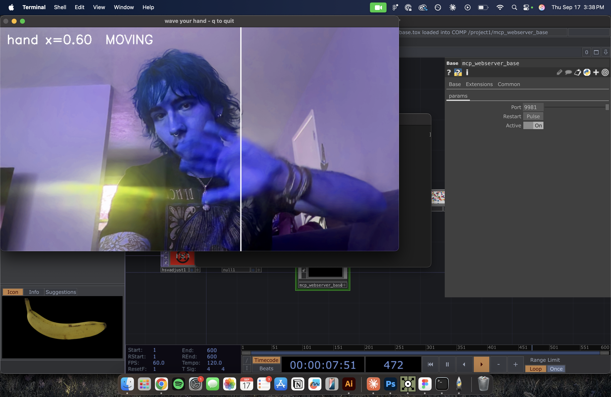

THIS IS MY BUILD LOG

09/09/2026 - I started this project. 
09/16/2026 - Got the weird mirror actually running. Wave your hand, the
whole image shifts hue. It took all day and almost none of that day was
spent on the part I thought would be hard.

**What it does now**

Webcam feed -> motion tracking in Python (OpenCV) -> hand position sent out
over OSC -> TouchDesigner picks it up on an OSC In CHOP and drives the Hue
Offset on an HSV Adjust TOP. There's also a standalone version that applies
the colour filter directly to the camera window without TouchDesigner
involved at all, which is what finally proved the whole thing worked.

**The hand tracking problem**

I wanted real hand tracking — actual finger landmarks, so I could do pinch
and gesture stuff later. That didn't happen, and it's worth writing down why:

- MediaPipe was the obvious choice, but the versions that installed
  (1.0.1, then 0.10.35) both shipped without the legacy `solutions` API
  that every tutorial online uses. It's just gone.
- The newer Tasks API is there, but the wheels ship **no model file**.
  Getting real hand landmarks means downloading `hand_landmarker.task`
  (~7.8 MB) separately from Google's model storage.
- So I dropped MediaPipe entirely and wrote motion tracking instead.

The consequence: **it does not actually track hands.** It tracks the largest
moving thing in frame. Waving works great, but it will just as happily follow
my head if that's what's moving. Good enough for a mirror, not good enough for
gestures. Real landmark tracking is the next thing to fix.

**Camera weirdness**

macOS kept throwing a Continuity Camera deprecation warning every time the
camera opened, and I burned a lot of time thinking my iPhone was being picked
up as camera 0 and feeding garbage. It wasn't that. A diagnostic showed
camera 0 returning live 1920x1080 frames with real variation the entire time.
Indices 1–3 didn't exist. The camera was never the problem — but the warning
sent me chasing it for a while.

**Everything else that went wrong**

- The project files got written somewhere unreachable at first, so `./run.sh`
  just returned "no such file or directory" and I assumed the script was
  broken. It wasn't — it wasn't there.
- My terminal was silently eating the first few characters of pasted commands.
  `cd ~/td-hand && ./run.sh` arrived as `un.sh`. This wasted a genuinely
  stupid amount of time, because commands appeared to run and do nothing.
- OpenCV installed as 5.0.0, which is days old. Downgraded to 4.12 to stop
  debugging against an untested build.
- First tracker used background subtraction. It poisoned its own background
  model with the camera's black warm-up frames and then never detected
  anything again. Replaced it with frame-to-frame differencing — compare each
  frame to the one before it, nothing to get stuck.
- Big backlit window behind me made auto-exposure hunt, which the background
  model read as the entire frame moving at once.
- Best part: for most of the session the tracker **was never actually
  running.** I was waving at a camera with no program watching it, reading
  stale output from an old run.

**TouchDesigner side**

Built the network with a Python script pasted into the Textport rather than
by hand — OSC In CHOP (port 7000), Noise TOP, HSV Adjust TOP, Null TOP,
wired and parameter-bound in one go. Verified it works by sending a fake
sweeping hand position over OSC with no camera involved, which cleanly
separated "is TouchDesigner right" from "is the tracker right."

Also installed the TouchDesigner MCP server (8beeeaaat/touchdesigner-mcp) to
let Claude drive TouchDesigner directly. The component loads and the web
server listens on 9981, but every API route returns an empty 404 — the
component isn't resolving its `modules/` folder. Unresolved, parked for now.

**Next**

- Real hand landmarks (download the MediaPipe model)
- Save the TouchDesigner project properly — it's still unsaved
- Fix or drop the MCP server
- Use handy for something; only handx is doing any work right now
